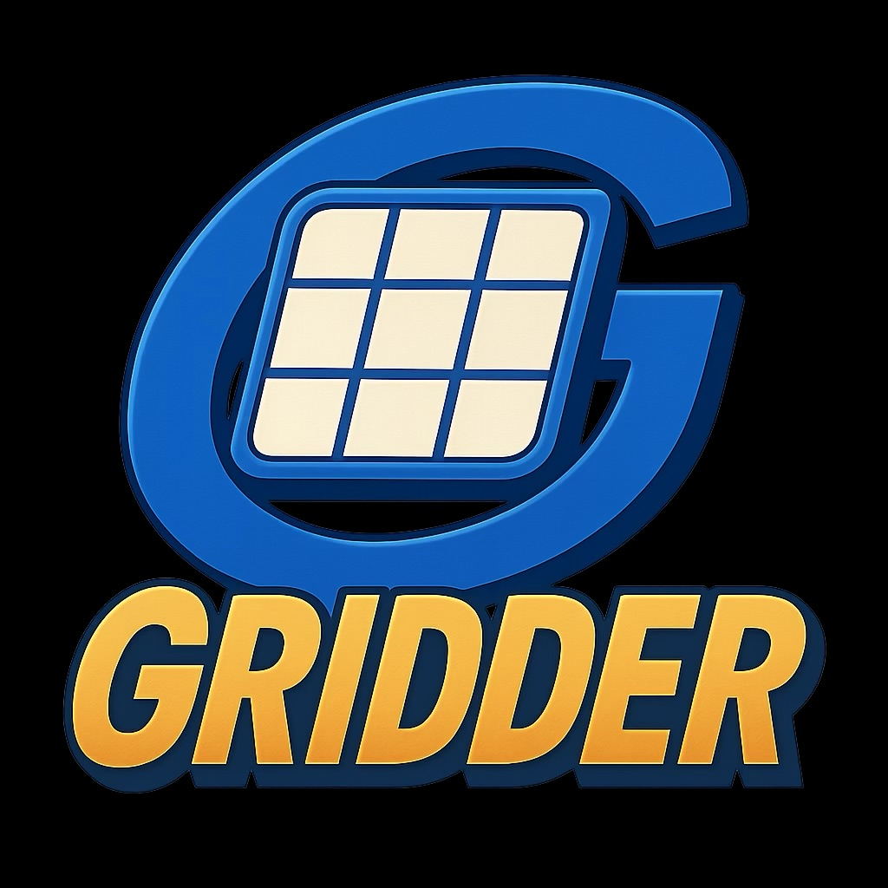

## A multi-purpose audio re-grid solution for DJs

Audio regridding solutions for DJs allow for the correction of drifting tempos in older tracks (disco, funk, classic rock) to make them mixable in modern, quantized software.

# Requirements

.net core SDK (10.0 recommended). https://dotnet.microsoft.com/en-us/download

# Building

`dotnet build`

# Running

`dotnet build -t:Run -f net10.0-ios`

`dotnet build -t:Run -f net10.0-maccatalyst`

# Current Issues

1. Reliance on runtime package for analysis: `pip install librosa numpy soundfile` 